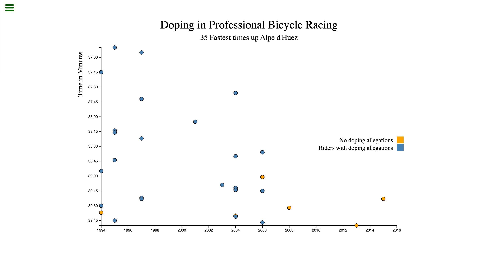

# freeCodeCamp - Visualize Data with a Scatterplot Graph

This is a solution to the [Visualize Data with a Scatterplot Graph](https://www.freecodecamp.org/learn/data-visualization/data-visualization-projects/visualize-data-with-a-scatterplot-graph) on freeCodeCamp.

## Table of contents

- [Overview](#overview)
  - [The challenge](#the-challenge)
  - [Screenshot](#screenshot)
  - [Links](#links)
- [My process](#my-process)
  - [Built with](#built-with)
  - [What I learned](#what-i-learned)
  - [Useful resources](#useful-resources)
- [Author](#author)

## Overview

### The challenge

Users should be able to:

- View the optimal layout for the site depending on their device's screen size
- Compare different racing time for cyclist with or without doping allegations
- Interact the scatter plot graph to learn about further information about each cyclist

### Screenshot

<table>
  <tr>
    <td>
      
    </td>
  </tr>
</table>

### Links

- Live Site URL: [here](https://zun-liang.github.io/fcc-d3-scatter-plot-graph)

## My process

### Built with

- HTML
- CSS
- TypeScript
- D3.js
- Vite
- Mobile-first workflow

### What I learned

- How to use D3.js to build a scatter plot graph
- How to use TypeScript and D3.js
- d3.timeParse vs d3.timeFormat

    d3.timeParse converts a date/time string into JavaScript `Date` object, while d3.timeFormat converts a JavaScript `Date` object into a string

- d3.tickFormat()
- How to add legend in D3
- non-null assertion operator
- to add border in d3 use stroke and stroke-width

### Helpful Resources
- [axis.tickFormat(format)](https://d3js.org/d3-axis#axis_tickFormat)
- [d3-format](https://d3js.org/d3-format#d3-format)
- [d3-time-format](https://d3js.org/d3-time-format#d3-time-format)
- [timeParse](https://d3js.org/d3-time-format#timeParse)
- [timeFormat](https://d3js.org/d3-time-format#timeFormat)
- [Object.prototype.valueOf()](https://developer.mozilla.org/en-US/docs/Web/JavaScript/Reference/Global_Objects/Object/valueOf)
- [Using the non-null assertion operator](https://learntypescript.dev/07/l2-non-null-assertion-operator)

## Author

- Website - [Zun Liang](https://zunldev.com/)
- GitHub - [@zun-liang](https://github.com/zun-liang)
- Frontend Mentor - [@zun-liang](https://www.frontendmentor.io/profile/zun-liang)
- freeCodeCamp - [@zun-liang](https://www.freecodecamp.org/zun-liang)
